# Construct

## The AI Coding Agent That Never Forgets & Never Stops

© 2026 Construct AI. All Rights Reserved.

[Website](https://construct.ai) • [Docs](https://docs.construct.ai) • [Support](https://support.construct.ai)

---

Construct is a desktop AI coding agent powered by a persistent memory system and multi-provider LLM integration. It understands your codebase, remembers every interaction, and autonomously plans, codes, tests, and commits.

## Screenshots

| Splash Screen | Main IDE View | Command Palette |
|:---:|:---:|:---:|
| 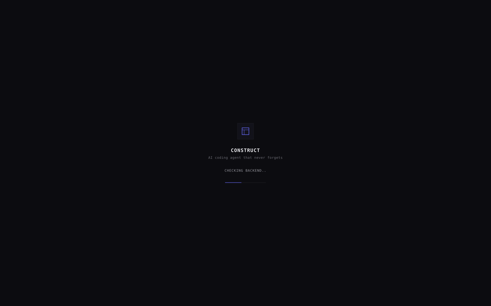 | 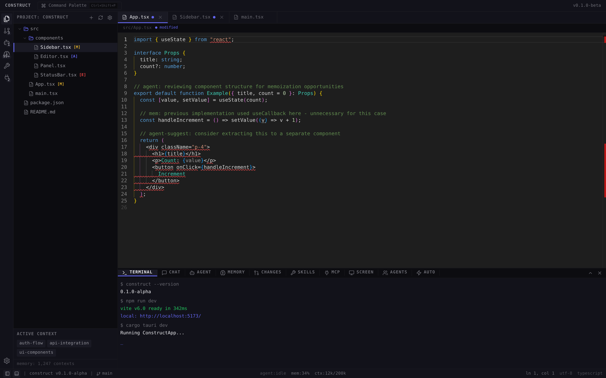 | 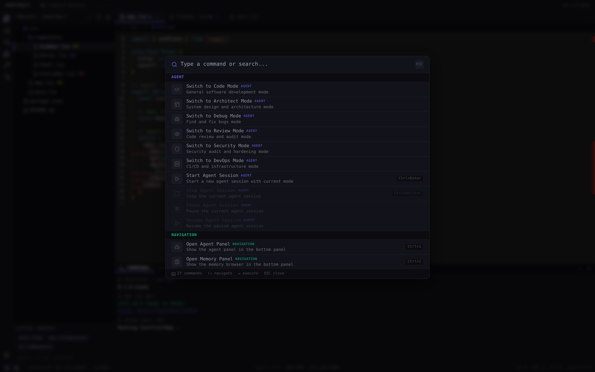 |

| Agent Panel | Memory Panel | Chat Panel |
|:---:|:---:|:---:|
| 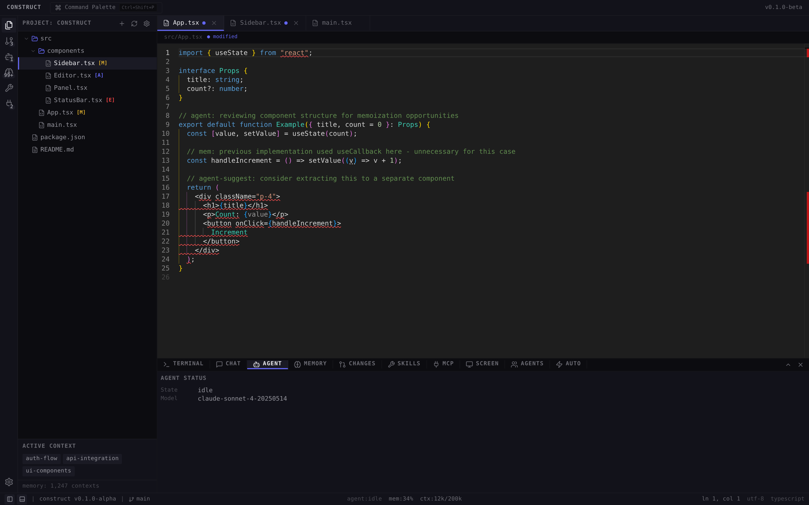 | 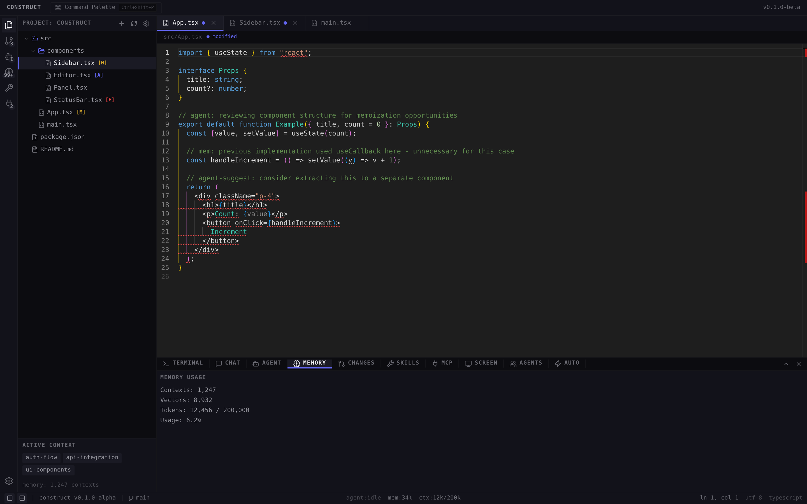 | 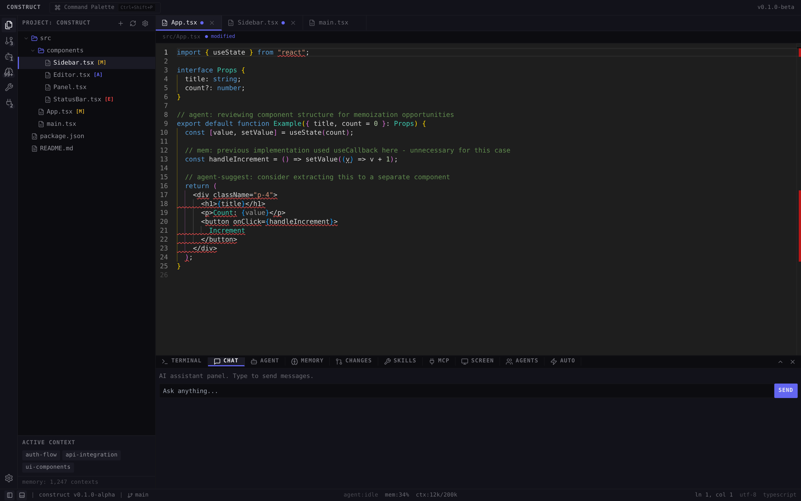 |

| Skills Marketplace | MCP Connectors | Multi-Agent |
|:---:|:---:|:---:|
| 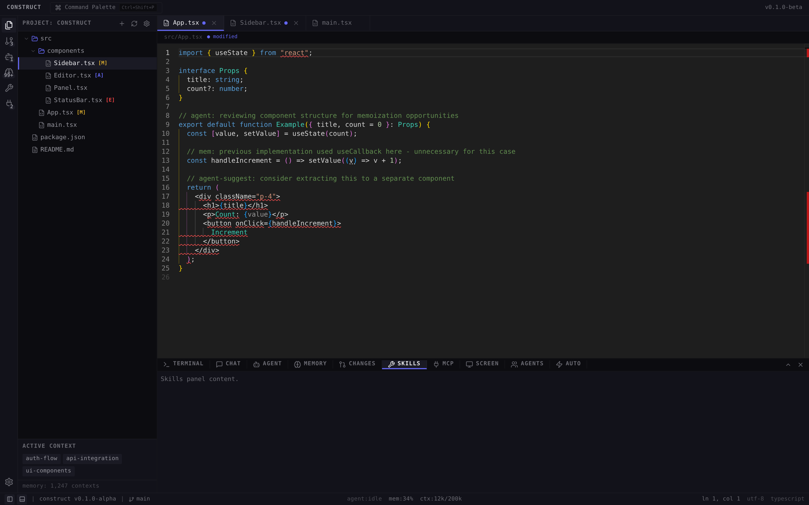 | 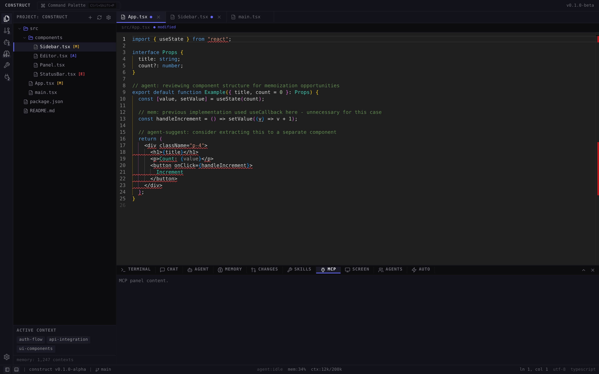 | 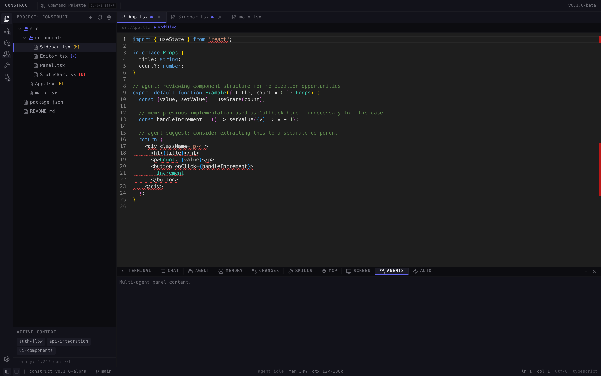 |

| Autonomous Mode | Diff/Changes | Screen Control |
|:---:|:---:|:---:|
| 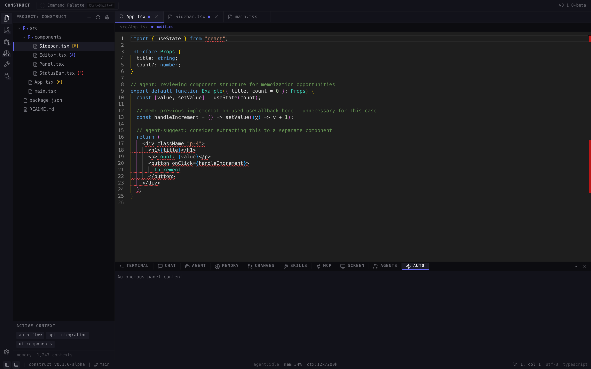 | 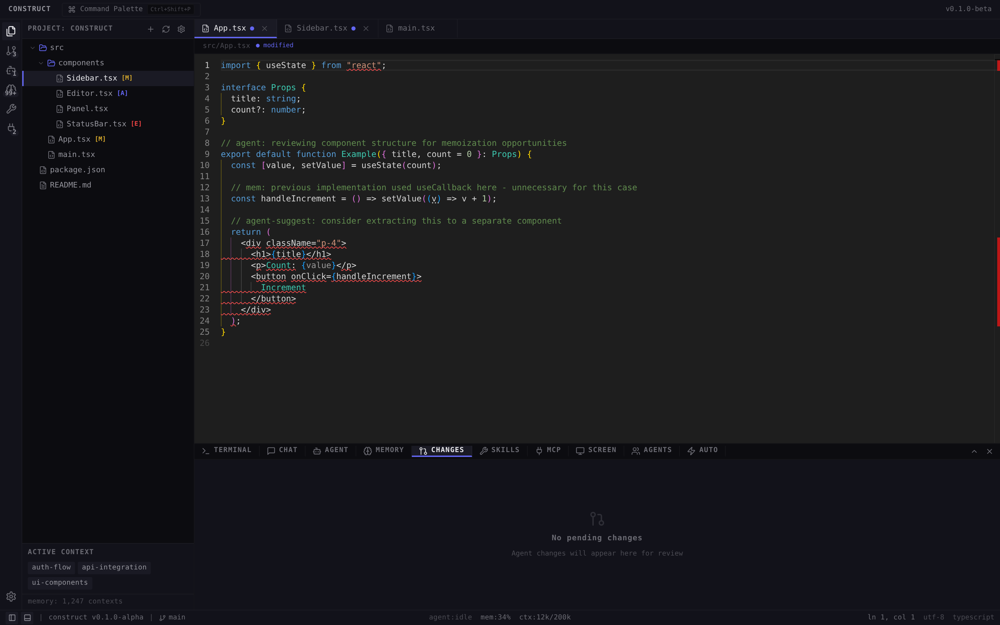 | 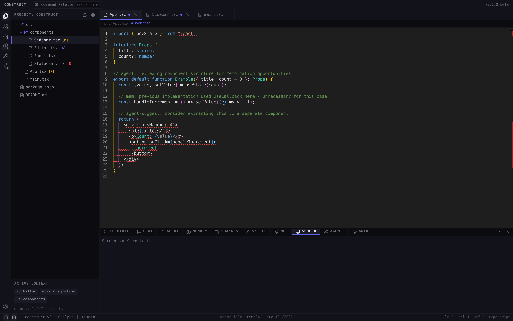 |

| Settings | Onboarding | Sidebar Collapsed |
|:---:|:---:|:---:|
| 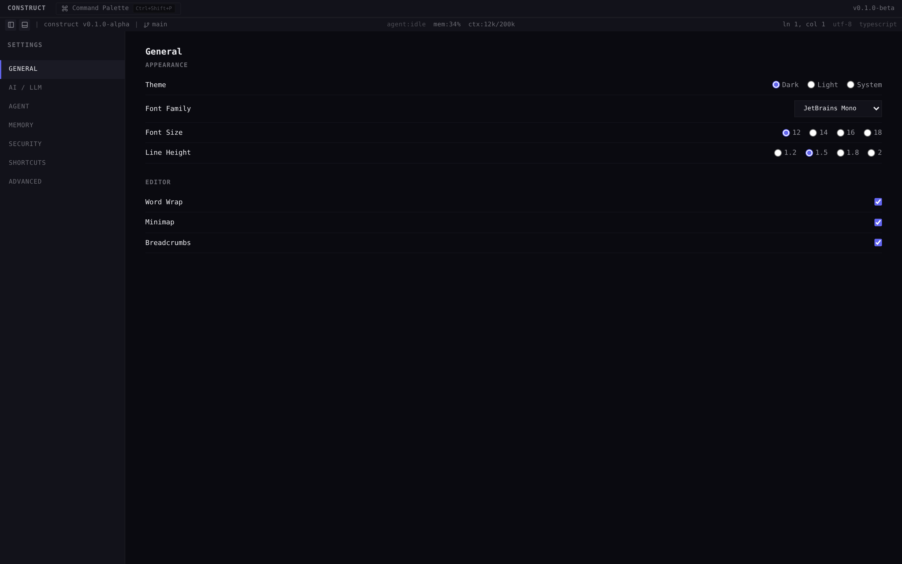 | 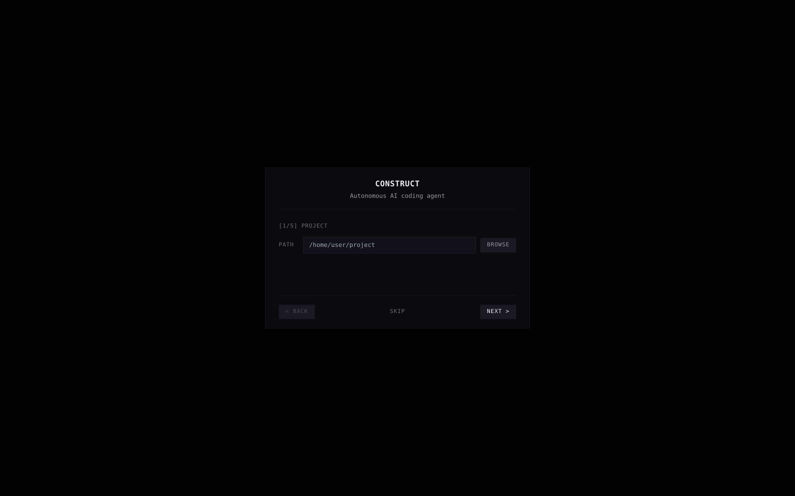 | 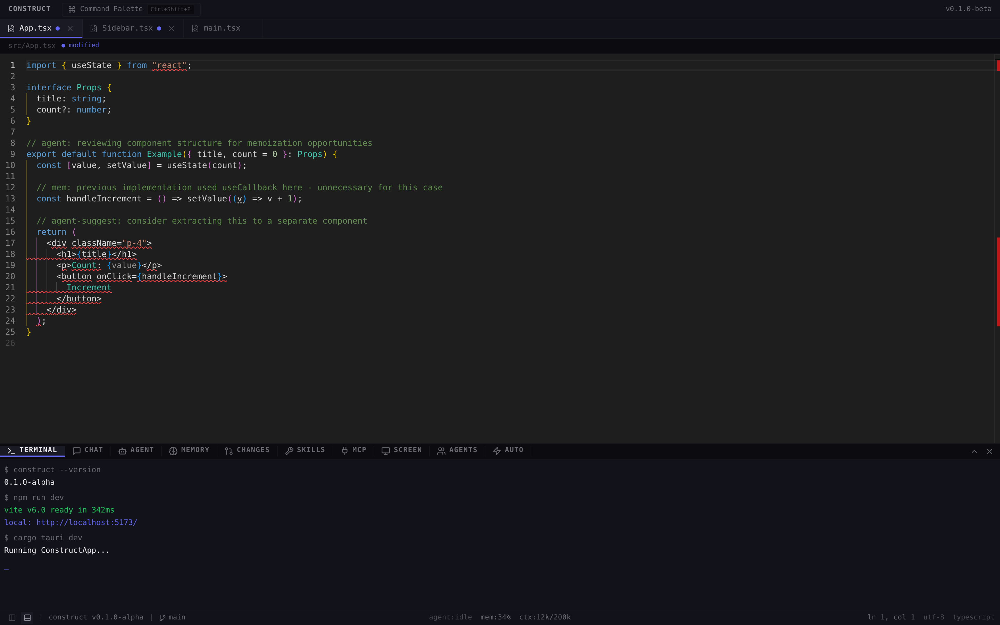 |

## Capabilities

- **Autonomous Agent** — Describe a goal, watch it plan, code, test, and commit
- **Persistent Memory** — Every conversation, code change, and preference is remembered
- **Semantic Search** — Find relevant past work via vector embeddings
- **Multi-Provider LLM** — OpenAI, Anthropic, Google, or local Ollama with smart routing
- **Full Tool System** — File operations, shell commands, git, and code refactoring
- **Streaming UI** — Real-time output with task progress and generated code
- **Monaco Editor** — Full-featured code editor loaded from CDN

## Tech Stack

- **Tauri v2** — Rust-powered desktop app shell
- **React 18 + TypeScript + Tailwind CSS** — Modern frontend
- **SQLite + ChromaDB** — Dual-layer persistent memory
- **Multi-Provider LLM** — OpenAI, Anthropic, Google, Ollama
- **39 Built-in Tools** — File, shell, git, code analysis, browser, database, document conversion, and binary analysis

## Project Structure

```
construct/
├── src/
│   ├── main/              # Tauri Rust backend
│   │   ├── src/
│   │   │   ├── main.rs    # Entry point
│   │   │   ├── lib.rs     # App logic & commands
│   │   │   ├── db.rs      # SQLite memory layer
│   │   │   └── commands/
│   │   │       ├── mod.rs
│   │   │       ├── memory.rs   # Memory Tauri commands
│   │   │       └── agent.rs    # Agent Tauri commands
│   │   ├── Cargo.toml
│   │   └── tauri.conf.json
│   ├── renderer/          # React frontend
│   │   ├── components/
│   │   │   ├── Sidebar.tsx
│   │   │   ├── Editor.tsx
│   │   │   ├── Panel.tsx         # Bottom panel (Terminal/Problems/Chat/Agent/Memory)
│   │   │   ├── AgentPanel.tsx    # AI agent control panel
│   │   │   ├── MemoryPanel.tsx   # Memory system UI
│   │   │   └── StatusBar.tsx
│   │   ├── stores/
│   │   │   └── useAppStore.ts
│   │   ├── types/
│   │   │   ├── index.ts
│   │   │   ├── memory.ts
│   │   │   └── agent.ts
│   │   ├── App.tsx
│   │   ├── main.tsx
│   │   └── index.css
│   └── shared/
├── agent-backend/           # Python backend
│   ├── core/                # LLM service, executor, sessions
│   ├── memory/              # ChromaDB semantic search
│   ├── tools/               # File, shell, git, code tools
│   ├── app.py               # FastAPI server
│   └── requirements.txt
├── package.json
├── vite.config.ts
├── tailwind.config.js
└── index.html
```

## Quick Start

### Prerequisites

- [Node.js](https://nodejs.org/) v18+
- [Rust](https://rustup.rs/) latest stable
- [Python 3.10+](https://python.org/)
- [Tauri CLI prerequisites](https://tauri.app/start/prerequisites/)

### Installation

```bash
# Install frontend dependencies
npm install

# Install Python backend dependencies
cd agent-backend
python -m venv .venv
source .venv/bin/activate  # Windows: .venv\Scripts\activate
pip install -r requirements.txt
cd ..
```

### Development

```bash
# Terminal 1: Start the Python backend
cd agent-backend
python -m uvicorn app:app --reload --port 8000

# Terminal 2: Start the Tauri app
npm run tauri:dev
```

### Building

```bash
npm run tauri:build
```

Output will be in `src/main/target/release/bundle/`.

## Memory System

Construct features a dual-layer persistent memory system:

### Layer 1: SQLite (Rust/Tauri)

| Table | Purpose |
|-------|---------|
| `conversations` | All user/agent message history |
| `code_events` | File changes, diffs, summaries |
| `user_preferences` | Learned preferences with confidence scores |
| `project_state` | Current project snapshot |

### Layer 2: ChromaDB (Python)

| Collection | Content |
|------------|---------|
| `conversation_embeddings` | Vectorized conversation messages |
| `code_embeddings` | Vectorized code events and diffs |

### Tauri Memory Commands

| Command | Description |
|---------|-------------|
| `record_conversation` | Store a conversation message |
| `recall_context` | Search across memory |
| `store_preference` | Save a learned preference |
| `get_preferences` | Retrieve all preferences |

## Agent System

### LLM Providers

| Provider | Models | Use Case |
|----------|--------|----------|
| OpenAI | GPT-4o | Complex reasoning |
| Anthropic | Claude Sonnet | Code generation |
| Google | Gemini 1.5 Pro | Long context |
| Ollama | qwen2.5-coder:14b | Local, fast, private |

### Tool System (39 Tools)

**File:** read_file, write_file, list_directory, search_files
**Shell:** execute_command, run_test, install_dependency
**Git:** git_status, git_diff, git_commit, git_branch, git_log, git_checkout
**Code:** parse_ast, find_references, refactor_rename, extract_function
**Document:** convert_document, batch_convert_documents, extract_document_structure
**Binary:** analyze_binary, decompile_function, find_vulnerabilities, compare_binaries
**Browser:** browser_navigate, browser_screenshot, browser_extract_text, browser_click
**Code Search:** code_search, code_find_definition, code_find_usages, code_file_structure
**Database:** db_connect_sqlite, db_connect_postgres, db_connect_mysql, db_query, db_list_tables, db_get_schema, db_disconnect

### Execution Loop

```
observe() → plan() → act() → verify()
   ↑___________________________|
```

The agent observes the project state, plans tasks, executes them using tools, and verifies results before continuing.

### Tauri Agent Commands

| Command | Description |
|---------|-------------|
| `start_agent` | Start a new session with a goal |
| `get_agent_status` | Get session status and tasks |
| `pause_agent` | Pause execution |
| `resume_agent` | Resume execution |
| `stop_agent` | Stop and terminate |

## Configuration

Copy `.env.example` to `.env` and configure:

```bash
cp .env.example .env
```

Key settings:
- `OPENAI_API_KEY` / `ANTHROPIC_API_KEY` / `GOOGLE_API_KEY` — LLM provider keys
- `OLLAMA_HOST` / `OLLAMA_MODEL` — Local LLM configuration
- `DB_PATH` — SQLite database location
- `CHROMA_PATH` — ChromaDB storage directory
- `REQUIRE_APPROVAL` — Safety level for destructive operations

## Security

- 45 regex patterns covering destructive operations, architecture changes, auth/payment code, and code-level security
- Path traversal protection at tool level
- Configurable protected paths
- AgentShield scans all generated code before execution
- Safety modes require human approval for destructive operations

## Roadmap (Not Yet Available)

- MCP server connections
- Screen control / GUI automation
- Auto-updates
- Plugin marketplace
- Multi-project workspaces

## Custom Theme

The app uses a Catppuccin-inspired dark theme with custom colors defined in `tailwind.config.js`. The editor has a custom Monaco theme called `"construct-dark"`.

## License

© 2026 Construct AI. All Rights Reserved.

This software is proprietary and confidential. Unauthorized copying, distribution, or use is strictly prohibited.

See `LICENSE` for the full software license agreement.
See `THIRD_PARTY_LICENSES.md` for open-source component attribution.
See `LEGAL.md` for AI-assisted development disclosure.
